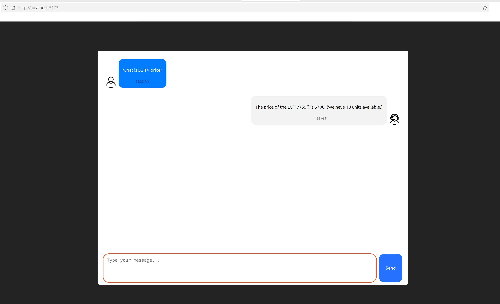

# Spring AI Function Calling Demo (Ollama)


## Overview

This README provides instructions on how to interact with a Spring AI application using function calling and local LLM on Ollama server.

Project based on https://github.com/Atharva1921/Spring-AI-Function-Calling - updated dependencies, added simple UI, additional tool and fall-back logic.

## Prerequisites

Before you start, ensure you have the following:
- **Java 21**: Ensure you have Java version 21 
- **Maven**:   Maven required to build Spring Boot application
- **Ollama** LLM Models server: demo is using Ollama LLM server. Recommended Nvidia GPU VRAM minimum is 16 GB.
- **npm** version > 11: npm used to run frontend
- **Docker** or local instance of **PostgreSQL DB**: demo is using DB to store product details.

## **How to use**

Backend is Spring Boot application configuration located in src/resources/application.properties file:

> ```
> spring.application.name=spring-tools-demo
> spring.ai.ollama.base-url=http://ollama-server:11434
> spring.ai.ollama.chat.model=mistral-nemo:12b
> # spring.ai.ollama.chat.model=llama3.1:8b-instruct-q4_0
> spring.ai.ollama.chat.options.temperature=0.0
> 
> spring.datasource.url=jdbc:postgresql://localhost:5432/test
> spring.datasource.username=user
> spring.datasource.password=password
> spring.jpa.hibernate.ddl-auto=update
> spring.jpa.properties.hibernate.dialect=org.hibernate.dialect.PostgreSQLDialect
> 
> # Enable or disable sample data initialization
> app.init-sample-data=true
> ```

## Ollama

Demo is using "mistral-nemo:12b" on Ollama host "ollama-server"

Install Ollama server using instructions from https://ollama.com/download , start ollama server and pull model using commands:

```bash
ollama serve
```

```bash
ollama pull mistral-nemo:12b
```

Open browser on http://ollama-server:11434 - it should print ollama server status

## DB

Next, configure DB: change spring.datasource settings for DB url, user and password if needed.

If using PostgreSQL in docker, synchronize settings with docker parameters in docker DB start script run_postgresql.sh:

``` bash
docker run --name pg-test \
-e POSTGRES_DB=test \
-e POSTGRES_USER=user \
-e POSTGRES_PASSWORD=password \
-p 5432:5432 \
-d postgres:16
```

Start PostgreSQL by running run_postgresql.sh or using docker command.

## Back-end

Start Spring Boot application by running maven command (or directly in IDE):

```bash
mvn spring-boot:run
```

Wait for the messages like

>  o.s.b.w.embedded.tomcat.TomcatWebServer  : Tomcat started on port 8080 (http) with context path '/'
>  org.lucentrix.demo.DemoApplication       : Started DemoApplication in 1.796 seconds (process running for 1.924)

Your Spring AI application is up and running on `http://localhost:8080`

Application configured to fill DB with sample data:

```java
List<Product> sampleProducts = List.of(
    createProduct("Apple iPhone 15", 1200, 5),
    createProduct("Samsung Galaxy S23", 1000, 10),
    createProduct("Google Pixel 8", 900, 7),
    createProduct("LG UltraGear Monitor", 400, 12),
    createProduct("Lenovo ThinkPad X1", 1500, 8),
    createProduct("Dell XPS 13", 1300, 6),
    createProduct("HP Spectre x360", 1250, 5),
    createProduct("Asus ROG Strix", 1400, 9),
    createProduct("Microsoft Surface Pro 9", 1100, 4),
    createProduct("Sony WH-1000XM5", 350, 15),
    createProduct("LG TV 55\"", 700, 10),
    createProduct("Samsung Fridge 300L", 1200, 6),
    createProduct("Lenovo IdeaPad 5", 650, 7),
    createProduct("LG Phone K51", 200, 20),
    createProduct("Samsung Galaxy A14", 250, 18),
    createProduct("Lenovo Tab M10", 180, 12),
    createProduct("LG Soundbar SL5Y", 150, 8),
    createProduct("Samsung Galaxy Buds", 130, 16),
    createProduct("Lenovo Legion 5", 1200, 5),
    createProduct("LG Refrigerator 400L", 1000, 3)
);
```


API endpoint:

http://localhost:8080/ai/ask

 You can check API from terminal using curl:

```bash
curl -X POST http://localhost:8080/ai/ask \
     -H "Content-Type: application/json" \
     -d '{"message": "What is the price of LG TV and what is the quantity available?"}'

Response:
The price of LG TV 55" is $700 and there are 10 units available. (Price may vary based on region and promotions)

```

## **Front-end**

Current version has VUE frontend, it is located in frontend-vue.

Install npm packages:

```bash
npm install
```

and run UI in dev mode:

```bash
npm run dev
```

Open UI application in browser using url from npm dev start:

```bash
  VITE v7.1.3  ready in 146 ms

  ➜  Local:   http://localhost:5173/
  ➜  Network: use --host to expose
  ➜  press h + enter to show help

```

Open http://localhost:5173/ and start conversation:

